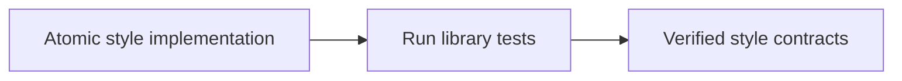

# Tests

<!-- directory-responsibility -->
Verifies atomic style exports and color behavior.

Key files: `colors.test.ts`, `index.test.ts`.

```mermaid
flowchart LR
    A["Atomic style implementation"] --> B["Run library tests"]
    B --> C["Verified style contracts"]
```
